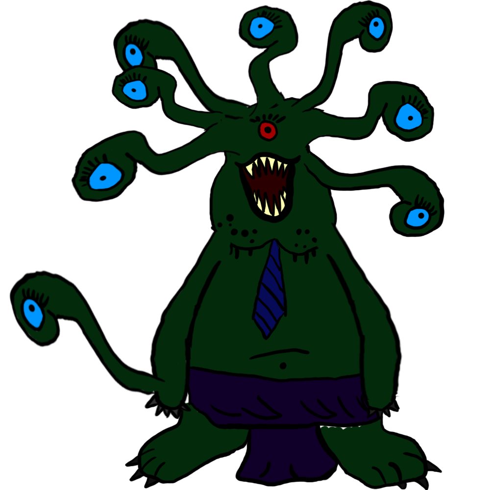

#ORPG

This is an ORPG game in 3D isometric.
It's coded in C++ using the Qt library.

There are 3 programs :
* The client
* The server
* The map editor

##Synopsis

The game takes place on a planet humans have colonized. They have tryed to genetically modify the DNA of the animals to increase the productivity.
But all didn't go as planed and the world is now destroyed, all the ancient technlogies have been forgotten and now, there is a war between the humans and the genetically modified animals, the monsters.

The goal of the game is to beat the 7 leaders of the monsters, which are humans that have modified their DNA and now want to rule other the world.

##Gameplay

The player can freely explore the world and when he goes to dangerous places, he can be attacked by monsters. Then the fight begins and it's a turn-based gameplay. Every player can do a limit amount of actions during his turn. All is about strategy, team work.

##State of advancement

The major problem of the game is its lack of graphisms. A friend of mine (Adèle Pelletant) did some beautifull graphisms but the amount of pictures needed is massive, way too much for one person.

